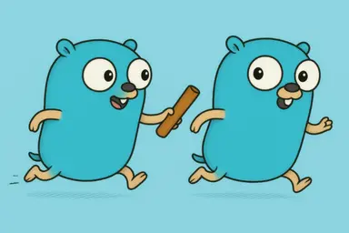

## Relay-WebChat



이 프로젝트는 개인 사이트, homin.dev 의 웹쳇 위젯을 로컬 서버에서 호스팅 하기 위해
세 개의 컴포넌트로 구성되어 있습니다.

```
┌─────────────────┐        ┌─────────────┐      ┌─────────────┐
│  WebChat Widget │◀─rest─▶│    Relay    │◀─ws─▶│  Processor  │
│    (client)     │        │   (cloud)   │      │  (local AI) │
└─────────────────┘        └─────────────┘      └─────────────┘
```

## WebChat Widget

React로 작성되어 있는 웹쳇 위젯.

Build:
```sh
cd webchat-widget
npm install
npm run build
```

웹페이지에 추가하기:
1. `dist/webchat-widget.umd.js`과 `dist/webchat-widget.css` 을 적당한 곳에 호스팅.
2. `dist/index.html` 파일을 참고해 웹쳇 위젯을 추가할 페이지에 다음의 예제와 같이 추가.

```html
</body>
  ...
  <script src="https://example.com/asset/script/webchat-widget.umd.js"></script>
  <link rel="stylesheet" href="https://example.com/asset/css/webchat-widget.css" />
</body>
```

## Relay

퍼블릭 클라우드에서 호스팅 중인, Go로 작성된 채팅 릴레이 서버.

웹쳇 위젯으로 부터 받은 메세지를 웹소켓으로 연결되어 있는 프로세서 서버에 전달하여 처리 결과를 응답.

## Processor

로컬 서버에서 호스팅 하는, Go로 작성된 대화 처리 서버.

Ollama 등의 로컬 AI를 연결하여. 추가 서비스비용 없이 대화형 챗봇을 구현 가능.